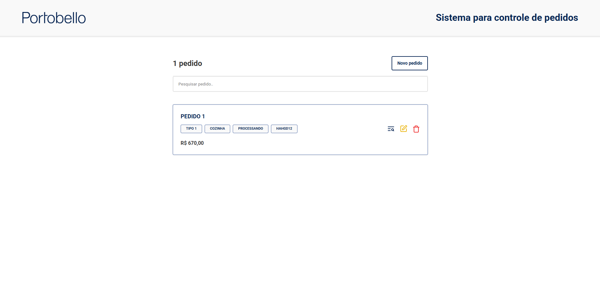

# Sistema de Pedidos B2B | Portobello



#### [Vídeo da aplicação funcionando](https://www.loom.com/share/c23732a4879c407f9d968340b15f68c7?sid=16435b7c-942a-46c9-9dd5-aa972ade7301)

## Passo a Passo para Testar o Projeto (Frontend e Backend)

### 1. Clonar o Repositório

```bash
git clone <URL_DO_REPOSITORIO>
cd PortobelloTeste
```

### 2. Backend

a) Pré-requisitos
Java 17+
Maven
Docker (para MongoDB)

b) Subir o MongoDB com Docker

```bash
docker run -d -p 27017:27017 --name mongo mongo:latest
```

c) Rodar o Backend

```bash cd portobelloBE
mvn clean install
mvn spring-boot:run
mvn test
```

### 3. Frontend

a) Pré-requisitos
Node.js 18+
npm ou yarn

b) Instalar Dependências

```bash
cd ../portobelloFE
npm install
# ou
yarn
```

c) Rodar o Frontend

```bash
npm run dev
# ou
yarn dev
```

##### Acesse a aplicação em: http://localhost:5173

d) Rodar os Testes do Frontend (se implementados)

```bash
npm test
# ou
yarn test
```

### 4. Testar a Aplicação

Crie, edite, visualize e exclua pedidos pelo frontend.
Verifique as respostas e logs no backend.
Consulte a documentação Swagger para testar endpoints diretamente.

## Backend

Este projeto é um microsserviço de pedidos B2B, desenvolvido como parte de um desafio técnico para a Portobello. Ele permite **criar, listar, editar e deletar pedidos por ID**, com persistência em MongoDB e documentação automática com Swagger.

---

### Tecnologias Utilizadas

- Java 17
- Spring Boot
- Spring Data MongoDB
- JUnit + Mockito
- Swagger
- Docker para MongoDB
- Lombok

---

### Endpoints REST

| Método | Rota            | Descrição               |
| ------ | --------------- | ----------------------- |
| POST   | `/pedidos`      | Criar um novo pedido    |
| GET    | `/pedidos`      | Listar todos os pedidos |
| GET    | `/pedidos/{id}` | Buscar pedido por ID    |
| PUT    | `/pedidos/{id}` | Editar um pedido        |
| DELETE | `/pedidos/{id}` | Deletar um pedido       |

📄 Swagger disponível em: [`http://localhost:8080/swagger-ui.html`](http://localhost:8080/swagger-ui.html)

---

### Exemplo de Payload – POST /pedidos

```json
{
  "nome": "Cuba Semi Encaixe Quadrada 410x410x145",
  "preco": 250,
  "tipoProduto": "Cuba Semi Encaixe Quadrada 410x410x145",
  "ambiente": "Banheiro",
  "codigo": "OPNK5B",
  "dataCriacao": "2025-07-17T20:33:53.984",
  "dataAtualizacao": null,
  "criadoPor": "Ana Lucia de Souza",
  "status": "ENTREGUE"
}
```

---

### Testes

Testes unitários implementados com JUnit 5 e Mockito.

```bash
mvn test
```

---

### Diferenciais

- Estrutura limpa e escalável
- Testes unitários com cobertura de regras de negócio
- Docker e Swagger integrados

---

### Melhorias Futuras

- Autenticação e autorização com JWT
- Paginação nos endpoints
- Logs

---

<br>
<br>

## Frontend

### Arquivos e Pastas

#### `pages/`

Contém as páginas principais da aplicação:

- **routes.tsx**: Define as rotas da aplicação usando React Router.
- **home/**: Página inicial, lista todos os pedidos, permite busca e exclusão.
- **createOrder/**: Página para cadastro de novos pedidos.
- **editOrder/**: Página para edição de pedidos existentes.
- **detailedOrder/**: Página de detalhes de um pedido específico.

---

#### `services/`

Serviços de integração com a API:

- **OrderService.ts**: Serviço principal para CRUD de pedidos, utilizando o `HttpClient`.
- **mappers/OrderMapper.ts**: Faz a conversão entre o modelo da API (persistência) e o modelo de domínio usado no frontend.
- **utils/HttpClient.ts**: Cliente HTTP genérico para requisições REST, com tratamento de erros.

---

#### `utils/`

Funções utilitárias globais:

- **formatCurrency.ts**: Funções para formatação, entrada e parsing de valores monetários.
- **toast.ts**: Funções e tipos para exibir notificações (toasts) na aplicação.

---

#### `errors/APIError.ts`

Classe utilitária para padronizar erros de requisições HTTP, encapsulando o objeto `Response` e o corpo retornado.

---

#### `hooks/useError.tsx`

Hook customizado para gerenciamento de erros de formulário. Permite adicionar, remover e buscar mensagens de erro por campo.

---

#### `lib/EventManager.ts`

Classe utilitária para gerenciamento de eventos customizados (pub/sub), usada principalmente pelo sistema de Toasts.

---

### Fluxo Básico

1. **Listagem de Pedidos**: Página inicial (`pages/home`) consome `OrderService` para buscar e exibir pedidos.
2. **Cadastro/Edição**: Formulários usam hooks de erro e funções utilitárias para validação e formatação.
3. **Detalhamento**: Página de detalhes exibe informações completas do pedido.
4. **Deleção**: Pedidos podem ser deletados ao confimar no modal de deleção (aberto por ícone na listagem da home)
5. **Notificações**: Toasts são disparados via `utils/toast.ts` e exibidos globalmente.

---

### Tecnologias

- React 18 + TypeScript
- React Router
- SCSS Modules
- Vite
- Integração com backend Java via REST

### Melhorias Futuras

#### Frontend

- **Autenticação e Autorização:** Implementar login, controle de sessão e permissões de acesso (ex: JWT).
- **Paginação e Filtros Avançados:** Adicionar paginação, filtros e ordenação na listagem de pedidos.
- **Responsividade Completa:** Melhorar a experiência mobile e adaptar o layout para diferentes dispositivos.
- **Internacionalização (i18n):** Suporte a múltiplos idiomas na interface.
- **Testes Automatizados:** Ampliar cobertura com testes unitários e de integração (React Testing Library, Cypress).
- **Feedback Visual Aprimorado:** Adicionar loaders, skeletons e animações para melhorar a experiência do usuário.
- **Validações Avançadas:** Regras de validação mais robustas nos formulários.
- **Gerenciamento de Estado Global:** Avaliar uso de Context API, Redux ou Zustand para estados compartilhados.
- **Documentação Técnica:** Gerar documentação automática dos serviços e hooks.
- **Acessibilidade:** Garantir navegação acessível (teclado, leitores de tela, contraste).
- **Deploy Automatizado:** Pipeline CI/CD para publicação automática do frontend.

#### Backend

- **Autenticação e Autorização:** Implementar autenticação JWT e controle de permissões por usuário.
- **Paginação e Filtros:** Adicionar paginação e filtros nos endpoints de listagem.
- **Logs e Monitoramento:** Implementar logs estruturados e monitoramento de erros.
- **Testes de Integração:** Ampliar cobertura de testes, incluindo testes de integração e de carga.
- **Documentação Avançada:** Melhorar a documentação da API com exemplos e cenários de uso.
- **Versionamento de API:** Adicionar versionamento para facilitar futuras evoluções.
- **Validação Centralizada:** Utilizar handlers globais para validação e tratamento de exceções.
- **Deploy Automatizado:** Pipeline CI/CD para publicação automática do backend.
- **Cache:** Implementar cache para consultas frequentes.
- **Rate Limiting:** Proteger a API contra abusos com
